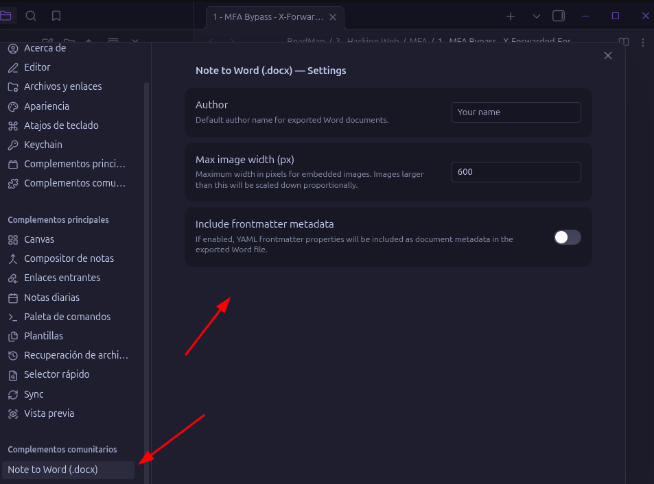
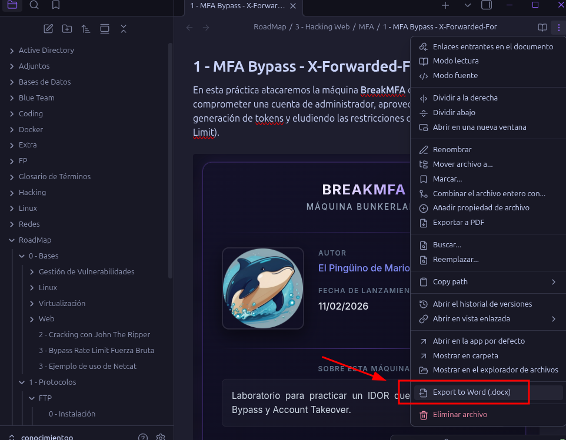
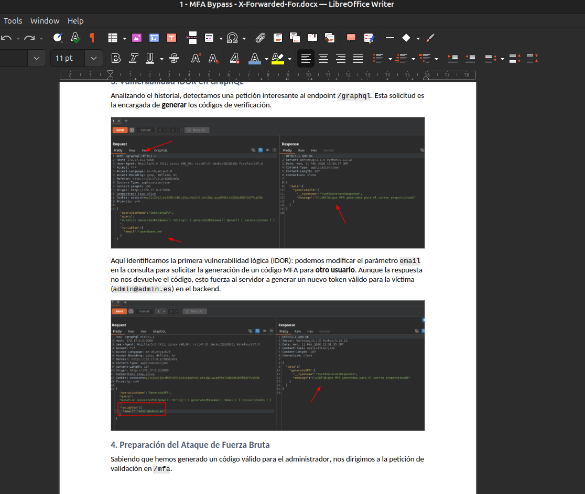

# PinguDoc — Obsidian Plugin



**PinguDoc** is an [Obsidian](https://obsidian.md) plugin that lets you export your notes to **Word (.docx)**, **OpenDocument (.odt)**, and **PDF (.pdf)** formats with a single click. All your formatting — headings, bold, italic, lists, tables, code blocks, callouts, and embedded images — is faithfully preserved in the exported document.

---

## Features

- **One-click export** — Use the ribbon icon, the command palette, or the right-click context menu on any `.md` file.
- **DOCX, ODT & PDF support** — Export to Microsoft Word (`.docx`), LibreOffice / OpenDocument (`.odt`), or PDF (`.pdf`).
- **Full formatting preservation** — Headings, bold, italic, strikethrough, inline code, code blocks, blockquotes, callouts, horizontal rules, and nested lists are all converted accurately.
- **Embedded images** — Images referenced in your notes (including wiki-link syntax like `![[image.png]]`) are resolved from the vault and embedded directly into the exported document.
- **Tables** — Markdown tables are converted into properly formatted, styled tables.
- **Configurable** — Choose the theme (light/dark) used when exporting to PDF.

---

## How to Use

### Export a Note

1. Open any Markdown note in Obsidian.
2. Click the **export icon** in the ribbon bar, or use the **Command Palette** (`Ctrl/Cmd + P`) and search for:
   - `Export current note to Word (.docx)`
   - `Export current note to ODT (.odt)`
   - `Export current note to PDF (.pdf)`
3. The exported file will be downloaded automatically.

You can also **right-click** any `.md` file in the file explorer and choose the export option from the context menu.



### Exported Document Preview

Below is an example of a note exported to Word format. Notice how headings, lists, and images are preserved:



---

## Installation

### From Obsidian Community Plugins (Recommended)

1. Open **Settings → Community Plugins** in Obsidian.
2. Click **Browse** and search for **"PinguDoc"**.
3. Click **Install**, then **Enable**.

### Manual Installation

1. Download `main.js`, `manifest.json`, and `styles.css` from the [latest release](https://github.com/Maalfer/pingudoc/releases).
2. Create a folder in your vault: `.obsidian/plugins/pingudoc/`
3. Copy the downloaded files into that folder.
4. Restart Obsidian and enable the plugin in **Settings → Community Plugins**.

---

## Settings

| Setting | Description |
|---|---|
| **PDF Theme** | Choose between light or dark theme for PDF exports. |

---

## Development

```bash
# Clone the repository
git clone https://github.com/Maalfer/pingudoc.git

# Install dependencies
npm install

# Start development build (watch mode)
npm run dev

# Production build
npm run build
```

**Requirements:** Node.js ≥ 16

---

## License

This project is licensed under the [0-BSD License](LICENSE).
